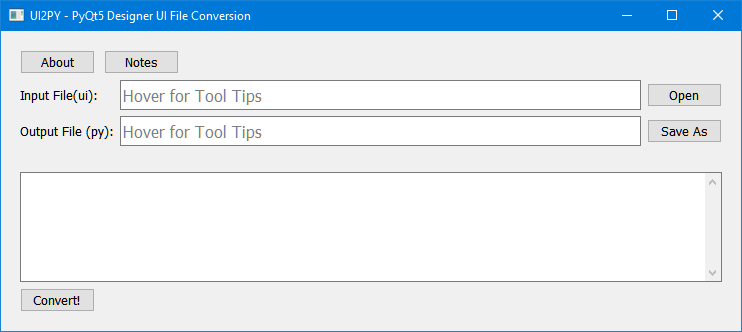

# Ui2Py

___

A simple GUI for the PYQt5 UIC tool.  
It makes quick and simple work of converting a QT Designer ui file to a py file.   

## Prerequisites (for binaries)

___
Windows OS (Developed on 10 but should work with 7 or 8)  

## Getting Started

___
Option 1 - Clone the repo and run it from the source.  
Option 2 - Grab the binary from the releases and run it.  

## Screenshot
___

## Built With
___
[PyCharm Community 2022.1](https://www.jetbrains.com/pycharm/)  

## Author
___
SDEarl https://github.com/SDEarl

## License
___
Due to the use of PyQt5, this project is licensed under:
    GNU GENERAL PUBLIC LICENSE, Version 3, 29 June 2007 
See [LICENSE](LICENSE) file for more information
